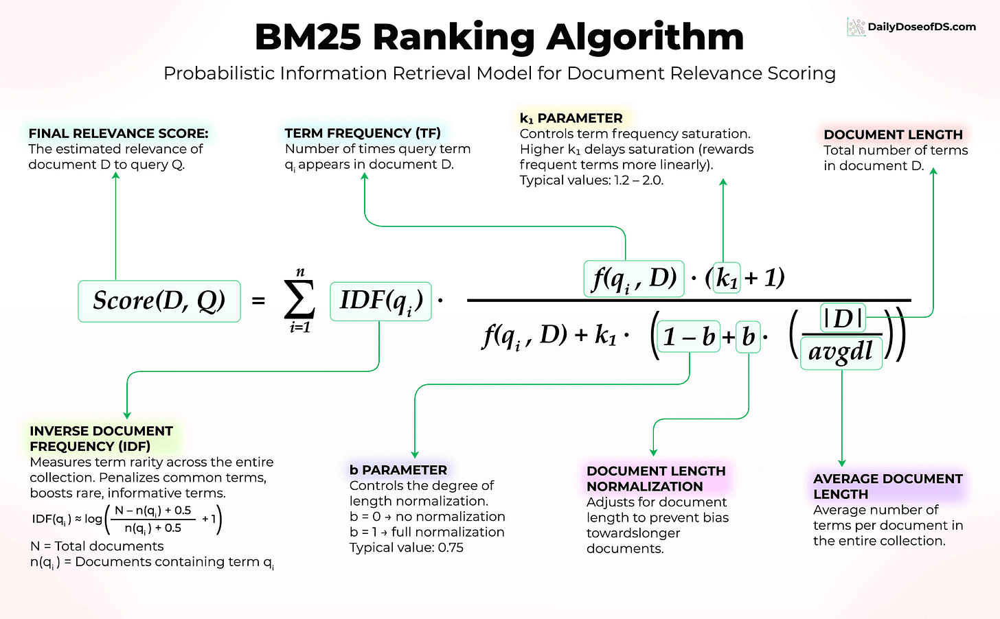

# BM25 Search Engine From Scratch

A complete implementation of the **BM25 (Best Matching 25)** ranking algorithm built from scratch, with a clean web-based interface for searching through arXiv research paper titles.

<div align="center">
  
</div>

### BM25 Formula Explained

**BM25 (Best Matching 25)** is a probabilistic ranking function that scores documents based on query terms:

```
BM25(D, Q) = Σ IDF(qi) × [(f(qi, D) × (k1 + 1)) / (f(qi, D) + k1 × (1 - b + b × |D| / avgdl))]
```

**Where**:
- `D` = Document being scored
- `Q` = Query (set of terms)
- `qi` = Individual term in the query
- `f(qi, D)` = Frequency of term qi in document D
- `|D|` = Length of document D (number of terms)
- `avgdl` = Average document length in the collection
- `k1` = Term frequency saturation parameter (typically 1.2 - 2.0)
- `b` = Length normalization parameter (typically 0.75)
- `IDF(qi)` = Inverse Document Frequency of term qi

**Key Components**:
- **IDF**: Weighs rare terms higher than common ones
- **TF Saturation**: Diminishing returns for repeated terms (controlled by k1)
- **Length Normalization**: Penalizes longer documents (controlled by b)

## 🚀 Quick Start

### Prerequisites
- Python 3.10+
- pip package manager

### Installation

1. **Clone the repository**
```bash
git clone <your-repo-url>
cd BM25-SCRATCH
```

2. **Install dependencies**
```bash
pip install fastapi uvicorn arxiv
```

3. **Load the dataset** (optional - data already included)
```bash
python arxiv_loader.py
```

### Running the Application

1. **Start the Backend API**
```bash
cd backend
uvicorn api:app --reload --port 8000
```

The API will be available at `http://127.0.0.1:8000`

2. **Open the Frontend**

Simply open `frontend/index.html` in your web browser, or use a local server:

```bash
cd frontend
python -m http.server 3000
```

Then navigate to `http://localhost:3000`

3. **Search!**

Enter search terms like "machine learning" or "neural networks" and get ranked results based on BM25 scoring.

---

## 📂 Project Structure

```
BM25-SCRATCH/
├── backend/
│   ├── api.py           # FastAPI server with CORS
│   ├── bm25.py          # BM25 algorithm implementation
│   └── search.py        # Search logic and document loading
├── frontend/
│   ├── index.html       # Web interface
│   └── style.css        # Styling
├── data/
│   └── arxiv_titles.txt # Research paper titles dataset
├── arxiv_loader.py      # Script to fetch arXiv data
└── README.md
```

---

## 🎯 Features

- **Pure Python Implementation**: BM25 algorithm built from scratch without external IR libraries
- **REST API**: FastAPI backend with CORS support
- **Clean UI**: Minimal, responsive web interface
- **Real Data**: Search through 200+ arXiv research paper titles
- **Relevance Scoring**: View BM25 scores for each result

---

## 📊 Understanding BM25

### What is BM25?

BM25 (Best Matching 25) is a probabilistic ranking function used by search engines to estimate the relevance of documents to a given query. It's an improvement over TF-IDF with saturation and length normalization.

---

## 📈 Information Retrieval Concepts

### 1. Term Frequency (TF)

**Definition**: Measures how often a term appears in a document.

**Formula**:
```
TF(t, d) = count of term t in document d
```

**Normalized**:
```
TF(t, d) = (count of t in d) / (total terms in d)
```

**Example**:

Document: *"deep learning is part of machine learning"*

| Term      | Count | TF (normalized) |
|-----------|-------|-----------------|
| learning  | 2     | 2/7 ≈ 0.286     |
| deep      | 1     | 1/7 ≈ 0.143     |
| is        | 1     | 1/7 ≈ 0.143     |

**Limitation**: Assigns high importance to common words like *"is"* or *"the"*.

---

### 2. Inverse Document Frequency (IDF)

**Definition**: Measures how rare a term is across the entire document collection.

**Formula**:
```
IDF(t) = log(N / df(t))
```

Where:
- `N` = total number of documents
- `df(t)` = number of documents containing term t

**Example** (assuming 1000 documents):

| Term         | Documents | IDF  |
|--------------|-----------|------|
| the          | 950       | low  |
| transformer  | 10        | high |

**Limitation**: Ignores term importance within a specific document.

---

### 3. TF-IDF

**Definition**: Combines TF and IDF to identify terms that are important in a document but rare across the corpus.

**Formula**:
```
TF-IDF(t, d) = TF(t, d) × IDF(t)
```

**Intuition**:
- High TF → important in document
- High IDF → rare in corpus
- High TF-IDF → informative term

**Example**:

| Term             | TF   | IDF  | TF-IDF |
|------------------|------|------|--------|
| backpropagation  | high | high | high   |
| is               | high | low  | ~0     |

**Limitations**:
- Bag-of-words representation (no word order)
- No semantic understanding
- Linear TF scaling
- Doesn't handle document length well

---

### 4. BM25 (Best Matching 25)

**Definition**: A probabilistic ranking function that improves upon TF-IDF with saturation and length normalization.

**Formula**:
```
BM25(t, d) = IDF(t) × [(tf × (k1 + 1)) / (tf + k1 × (1 − b + b × |d| / avgdl))]
```

**Parameters**:

| Parameter | Meaning                           | Typical Value |
|-----------|-----------------------------------|---------------|
| tf        | Term frequency in document        | -             |
| \|d\|     | Document length (word count)      | -             |
| avgdl     | Average document length           | -             |
| k1        | TF saturation parameter           | 1.2 - 2.0     |
| b         | Length normalization parameter    | 0.75          |

**Key Improvements over TF-IDF**:

1. **Term Frequency Saturation**: Diminishing returns for repeated terms
2. **Document Length Normalization**: Penalizes long documents, rewards focused ones
3. **Tunable Parameters**: `k1` and `b` can be adjusted for different datasets

**Intuition**:
- Repeating a term 10 times isn't 10× more relevant than repeating it once
- Long documents shouldn't dominate just because they mention terms more
- Short, focused documents often provide better answers

---

## 📊 Comparison Table

| Method   | What It Captures              | Main Limitation           |
|----------|-------------------------------|---------------------------|
| TF       | Term importance in document   | No global context         |
| IDF      | Term rarity across corpus     | No document relevance     |
| TF-IDF   | Local + global importance     | Linear TF scaling         |
| BM25     | Probabilistic relevance       | Lexical matching only     |

---

## 🔧 API Endpoints

### Search Endpoint
```
GET /search?query={query}&k={number_of_results}
```

**Parameters**:
- `query` (required): Search query string
- `k` (optional, default=50): Maximum number of results

**Response**:
```json
[
  {
    "title": "Heterogeneity in Multi-Agent Reinforcement Learning",
    "score": 6.2031
  },
  ...
]
```

---

## 🎨 UI Features

- **Responsive Design**: Works on desktop and mobile
- **Real-time Search**: Results update instantly
- **Score Visualization**: See BM25 scores for each result
- **Clean Interface**: Minimal, distraction-free design
- **Keyboard Support**: Press Enter to search

---

## 📝 Implementation Details

The BM25 implementation includes:

- Custom document indexing
- Term frequency calculation
- IDF computation with smoothing
- Configurable k1 and b parameters
- Efficient scoring for multiple queries

---

## 🤝 Contributing

Contributions are welcome! Feel free to:
- Report bugs
- Suggest features
- Submit pull requests

---

## 📄 License

This project is open source and available under the MIT License.

---

## 🙏 Acknowledgments

- arXiv for providing research paper data
- FastAPI for the excellent web framework
- The IR community for BM25 research